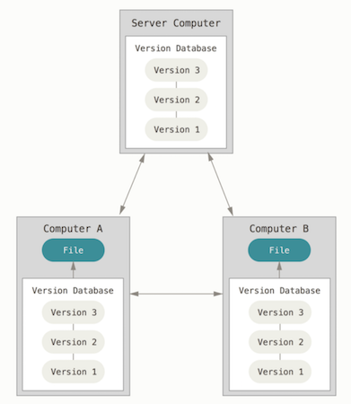
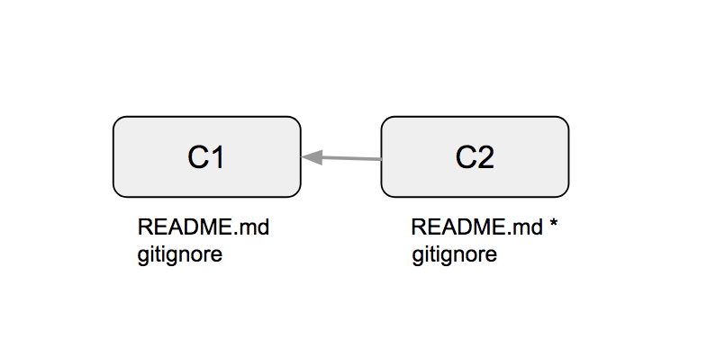
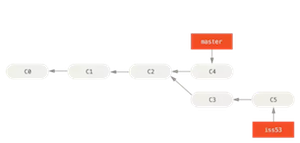
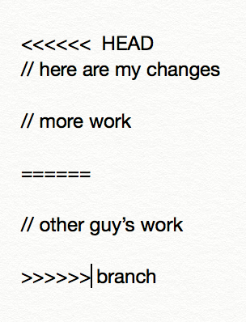
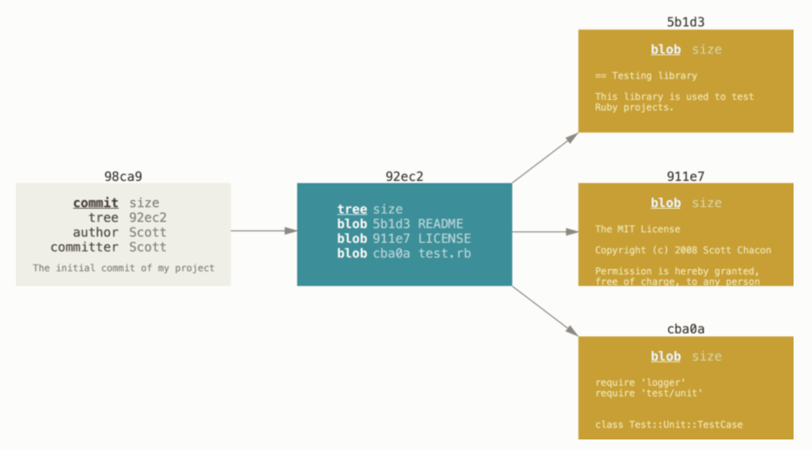
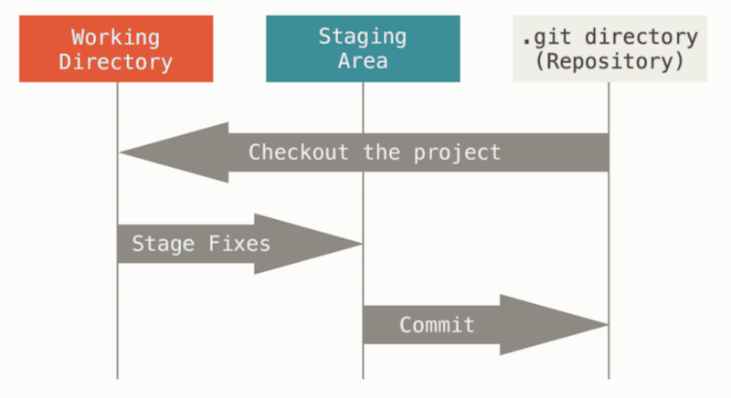

# Basics 

A basic workshop to learn the world of git

Note:
Everyone needs to have the following things before we start the class
* git 
* github account
* Node and NPM

---

### What is git?

- Short history
- Alternatives (SVN, Mercurial, etc)
- Distributed version control

Note:
* Short history. Git and linus torvalds
* SVN and Mercurial

----

Centralized Version Control


Local Version Control


Note:
* Mention the idea of working with other people through the network. 

----

#### Distributed vesion control system
 
It looks something like this 



Note:


---

## Let's do some coding

---

### Configuration

```bash
git init test
cd test

git config --local user.name andres
git config --local user.email andres.jorquera@kairosds.com

ls .git
HEAD    config    description    hooks    info    objects    refs
```

Note: 
* Talk about why configuring email and name is important
* Mention where git stores its data. "." means hidding directory in unix

---

### First commits

1. Create the following files: .gitignore, README.md

2. Stage files 

	```bash
	git status
	git add .gitignore README.md
	git status
	```

3. Commit 

	```bash
	git commit
	git status
	```

4. Add your name to README.md and commit

Note:
* Explain the utility of both files. 
* A possible message could be, your name and a description about yourself

----

We have something like...



Note:
* Mention the arrows

---

### Branching and merging

1. Create a new branch

	```
	git branch
	git branch -b feat/tests
	git branch
	```

2. Create a simple test in test/basic.js and commit

	```javascript
	const assert = require('assert');

	describe('git basics challenge', ()=> {
		it('should return the must basic test of all', () => {
			assert(true);
		});
	});
	```

Note:
* Talk a little bit about test in software

----

3. Go back to master and do a bit of work...

	```bash
	git checkout master
	git branch
	
	#working...

	git commit
	```

Note: 
* Talk about how the files disappear

4. Merge test branch

	```
	git branch
	git merge feat/test
	```

Note: 
* Do a list of things you like
* We want the work we did in the other branch
* Check the recursive strategy

----

This is what we have done...


Note: 
* Introducing branch and HEAD in graph
* Show an interactive procedure of what we have done. (link)[https://learngitbranching.js.org/]

----

### Merge Strategies

Fast forward


Recursive strategy



Note:

---

### Remotes

1. Go to this [link](https://classroom.github.com/a/5HXmOy1H) and accept the assignment

2. Add the remote from the new repo

	```bash
	git remote add origin https://github.com/github-basics/assign-cmb-${username}
	git remote -v
	```

3. Push
	```bash
	git push
	git push --set-upstream origin master
	git fetch
	git merge origin/master
	git merge origin/master --allow-unrelated-histories
	git push
	```

Note: 
* Talk about git pull ---> git fetch && git merge
* Allow unrelated stories

----

4. Merge more tests from origin/feat/more-tests
	```bash
	git branch 
	git branch -a
	git merge origin/feat/more-tests
	git push
	```

Note:
* show the repo before and after pushing
* show animation of what we have done
* Explain pull vs fetch

----

#### Git hosting

- Github 
- Bitbucket 
- Gitlab
- Microsoft Visual Studio Team Services

---

### Merge Conflicts
	
1. Merge branch feat/conflicts-watch-out
  
	```bash
	git merge feat/conflicts-watch-out
	git status
	```

Note: 

----

### Conflicts - File modified



```bash
#open file with an editor
nano README.md
git add README.md
git status
```

----

### Conflicts - File deleted

```bash
git rm garbage.txt
git status
git commit
```

----

#### Tools for resolving conflicts

- Text editors
- IDE
- Applications

---

### Tagging 

- Lightweigh

	```bash
	git tag 1.0.0
	```

- Annotated
	```bash
	git tag -a 1.0.1 -m 'My annotated tag 1.0.1'
	git push --tags 
	```

Note: 
Maybe we could talk about NPM version and version control

---

### Visualizing git

* IDE plugins
* Web Interfaces
* Applications
* Git


```
git config --local alias.lg "log --graph --abbrev-commit --decorate --format=format:'%C(bold blue)%h%C(reset) - %C(bold green)(%ar)%C(reset) %C(white)%s%C(reset) %C(dim white)- %an%C(reset)%C(auto)%d%C(reset)' --all"
```

Note: 
* Check github account for our new commits and tags and network

---

## Core Basics

----

### Snapshots

This is the most simplified git you have seen:


But, how about we go deeper...

Note:
Talk about the meaning of snapshots. 

----

#### Database - commit, tree and blob



----

### References 

Branches, HEAD, tags, remotes


 Note: 
 * Explain HEAD => branch => commit

----

#### Integrity

Cryptographic hash function SHA-1

```
shasum README.md
dd122581c8cd44d0227f9c305581ffcb4b6f1b46 README.md

echo " " >> README.md

shasum README.md
da39a3ee5e6b4b0d3255bfef95601890afd80709 README.md
```

----

### States

```
echo "Hello" >> README.md
git add README.md
git commit -m "my commit message" 
```



---

### Homework

Let's put your skills to the test. Your challenge as a student is to complete the following tasks that are describe in the folloging [wiki](https://github.com/ajorquera/git-basics/wiki/homework)

--- 

## Part 2

---

## Git reset
* Reset --soft
* Reset --mixed
* Reset --hard
* Reset path

Note: 
reset --hard is dangerous. Deletes data 

----

### The three trees

[tree threes](assets/img/three-trees)

---

## Git checkout

* Checkout files 
* Checkout commits
* Checkout tags
* Checkout branches

Note: 
* Detached HEAD
* What would happend if I commit in detached HEAD
* Think of an interactive way of showing HEAD changing

---

## Reset vs Checkout


Note: 
* A lot of confusion with them
* Some cases you can use them interchangable. git checkout path = git reset --hard path

## Git stash
* Simple
* Interactive
* Creating branch

Note: 
* Some people doesnt recommend stashing because you could forget and loose information
* Show examples in terminal
* Stashing could bring conflicts

## Git Rebase


---

## Coding time...

---

### 3rd assignment

1. Got to this [link]() and accept the assignment. 
2. Add the new remote and push
3. Remove previous merge with reset
4. Rebase branch to master. 
5. Merge
6. Rebase interactive, Squash, commit, delete, edit

----

This is what we did

[rebasing-assignemnt](assets/img/)

---

## Rebase vs Merge
* Rebase can be dangeoures, because push -f
* Rebase creates a cleaner history
* Whatever you choose, be consistent as a team

---

## Workflows

* Feature branching
* Succesful git workflow
* Github workflow

----

### Feature Branching


[More info...](https://www.atlassian.com/git/tutorials/comparing-workflows/feature-branch-workflow)

----

### Successfull git workflow

[More info](https://nvie.com/posts/a-successful-git-branching-model/)

---- 

### Github workflow

[More info...](https://guides.github.com/introduction/flow/)

--- 

## Useful commands
* Git alias. Check out this [link](https://gist.github.com/robmiller/6018582)
* Git gc
* Git blame or github blame
* Git log, shortlog

Note:
Show some examples in the terminal

## Documentation
* Pro Git (Digital version is free on amazon)
* Awesome list. [More info...](https://github.com/sindresorhus/awesome)
* Git website
* Youtube
